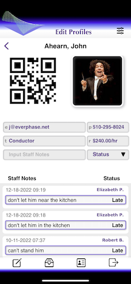
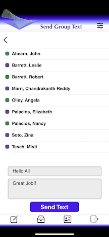
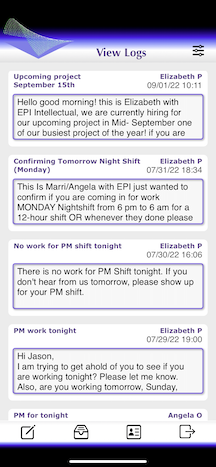

#  &nbsp; <a href="https://github.com/jahearnco/MarcaApp/tree/main/MarcaApp">MarcaApp</a>
MARCA :: a Management And Resources Coordination Application

MARCA :: currently an AWS based Operations and Resource Management suite implemented for a large scale mail-in balloting production. 

MARCA :: coordinates communications, notifications, reports, analyses, workgroups, operations, training & non-human resources.

MARCA :: leverages fast DynamoDB-Java workgroup lookup routines.

MARCA :: can be configured for most organization from families to clinics to mid-sized businesses to personal projects. Etc.

MarcaApp :: an Amplify-Swift MARCA app with limited features including workgroup messaging/texting & resource profile editing.
#  &nbsp; <a href="https://youtu.be/eff2Ofq2ft0">Watch Video</a>
   &nbsp; &nbsp; &nbsp;  &nbsp; &nbsp; &nbsp; &nbsp; &nbsp; &nbsp; &nbsp; &nbsp;   &nbsp; &nbsp; &nbsp; &nbsp; &nbsp; &nbsp; &nbsp; &nbsp; 

#  &nbsp; <a href="https://github.com/jahearnco/MarcaApp/tree/main/MarcaApp/Views/CustomViews">Custom Views</a>
   <a href="https://github.com/jahearnco/MarcaApp/tree/main/MarcaApp/Views/CustomViews/MarcaButton.swift">MarcaButton</a> 
   <a href="https://github.com/jahearnco/MarcaApp/tree/main/MarcaApp/Views/CustomViews/MarcaLogView.swift">MarcaLogView</a> 
   <a href="https://github.com/jahearnco/MarcaApp/tree/main/MarcaApp/Views/CustomViews/MarcaSelect.swift">MarcaSelect</a> 
   <a href="https://github.com/jahearnco/MarcaApp/tree/main/MarcaApp/Views/CustomViews/MarcaTextField.swift">MarcaTextField</a>
#  &nbsp; <a href="https://github.com/jahearnco/MarcaApp/tree/main/MarcaApp/Ancillary/Auth/Cognito.swift">Auth</a>
      AWS Cognito
      KeyChainProxy
#  &nbsp; <a href="https://github.com/jahearnco/MarcaApp/blob/main/MarcaApp/Ancillary/Constants/MarcaEnums.swift">Enums</a>
    enum KeychainError: Error
    enum MarcaViewChoice
    enum MarcaProfileTitle:String,CaseIterable
    enum MarcaLoginMenuChoice:String,CaseIterable
    enum MarcaCreateTextMenuChoice:String,CaseIterable
    enum MarcaEditProfilesMenuChoice:String,CaseIterable
    enum MarcaProfileStatusChoice:String,CaseIterable
    enum MarcaLogsViewMenuChoice:String,CaseIterable
    enum MarcaSelectType:String,CaseIterable
#  &nbsp; <a href="https://github.com/jahearnco/MarcaApp/blob/main/MarcaApp/Ancillary/Models/_M.swift">Model</a>
    @Published var cacheKiller:String
    @Published var isPortraitOrientation:Bool
    @Published var isLoginButtonPressed:Bool
    @Published var headerHeight:CGFloat
    @Published var footerHeight:CGFloat
    @Published var menuDoesAppear:Bool
    @Published var tapOccurred:Bool
    @Published var fieldMaybeInFocus:Field?
    @Published var inEditingMode:Bool
    @Published var authDidFail:Bool
    @Published var mainViewChoice:MarcaViewChoice
    @Published var taskViewChoice:MarcaViewChoice
    @Published var isLogoutChoiceButtonPressed:Bool
    @Published var appFullScreenAspectRatio:CGFloat
    @Published var appFullWidth:CGFloat
    @Published var appFullHeight:CGFloat
    @Published var isLoggingOut:Bool
    @Published var isUserLoggedIn:Bool
    @Published var currentViewTitle:String
    @Published var loggedInUsername:String
    @Published var profile:Profile
    @Published var profileStaffNotes:[[String:String]]
    @Published var user:User?
    @Published var logs:[[String:String]]
    @Published var communityLogs:[[String:String]]
    @Published var cellPhoneDict:[String:String]
    @Published var textGroupEmployees:[[String:String]]
    @Published var profileGroupEmployees:[[String:String]]
    @Published var overlayIsShowing:Bool
    @Published var profileGroupCats:[[String:String]]
    @Published var textGroupCats:[[String:String]]
#  &nbsp; <a href="https://www.everphase.net/resume">Everphase</a>
Full Stack :: iOS :: AWS :: iOT :: LAMP :: Smart Devices :: EE :: Engineering Physics

